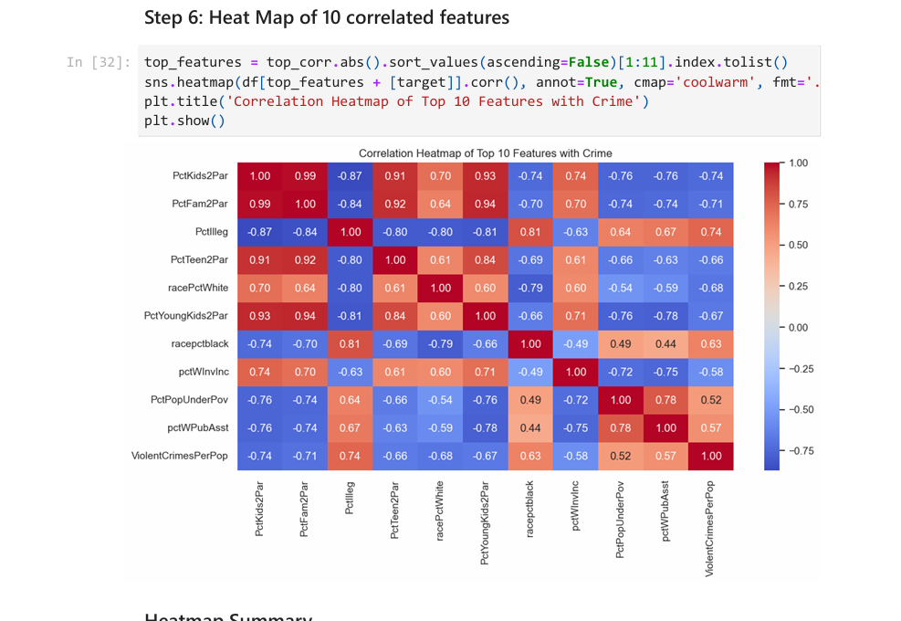
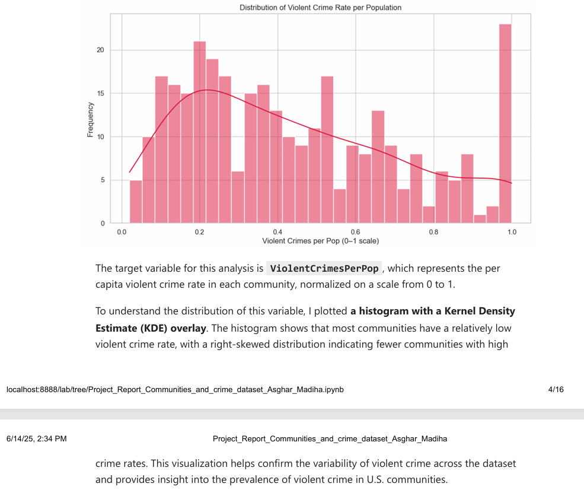

# Communities and Crime Analysis

📊 **Exploring Socioeconomic and Law Enforcement Factors Influencing Violent Crime in U.S. Communities**

This repository contains my project analysis on the **UCI Communities and Crime dataset**, investigating how various community indicators relate to violent crime rates.

---

## 📁 About the Dataset
- **Dataset Source:** [UCI Machine Learning Repository – Communities and Crime](https://archive.ics.uci.edu/ml/datasets/communities+and+crime)
- **Data Integrated From:**
  - 1990 U.S. Census
  - 1990 Law Enforcement Management and Administrative Statistics (LEMAS) survey
  - 1995 FBI Uniform Crime Report (UCR)
- **Scope:** 1,994 U.S. communities, 128 attributes
- **Key Indicators:** Education levels, income, housing conditions, racial composition, family structure, police resources
- **Target Variable:** `violentCrimesPerPop` – per capita rate of violent crimes (murder, rape, robbery, assault)

---

## 🎯 Project Motivation
For my first project report, I wanted a dataset that would allow extensive exploratory data analysis (EDA) and regression techniques.  
The **Communities and Crime** dataset offered a challenging yet engaging opportunity to uncover insights into factors affecting violent crime rates.  

---

## 🔍 Big Question
**How do socioeconomic and law enforcement variables relate to violent crime rates across U.S. communities?**

---

## 📊 Regression Methods & Results
- **Methods Used:**
  - Correlation Analysis
  - Simple Linear Regression
  - Multiple Linear Regression
  - Ridge Regression
- **Best Model:** Ridge Regression  
  - **R² Score:** 0.654  
  - Moderately strong ability to predict violent crime rates based on socioeconomic and law enforcement indicators.

---

## 💡 Key Insights
Top predictors of violent crime include:  
- **TotalPctDiv:** % of divorced individuals  
- **PctYoungKids2Par:** % of young children with two parents  
- **PctIlleg:** % of births to unmarried women  
- **PctVacantBoarded:** % of vacant/boarded housing  
- **PctUnemployed:** % of unemployed  

> These results indicate that family instability, economic stress, and community decay strongly influence violent crime rates. Insights can guide policymakers and community planners.

---

## 📈 Visual Analysis

### 1. Top 10 Feature Correlations (Heatmap)
  
*Heatmap showing the correlation of the 10 most influential features with violent crime rates per population.*

### 2. Distribution of Violent Crimes Per Population
  
*Histogram showing the distribution of violent crimes per capita across 1,994 U.S. communities.*

---

## ⚡ Features
- Clean, well-documented project notebook in Jupyter
- Full EDA including correlations and visualizations
- Regression analysis to predict violent crime rates
- Insights for social and policy applications

## 🛠 How to Use
1. Clone this repo.  
2. Open `Project_Report_Communities_and_crime_dataset_Asghar_Madiha.ipynb` in Jupyter Notebook.  
3. Explore EDA, regression models, and charts.  
4. Replace or extend charts if you perform additional analysis.

---
